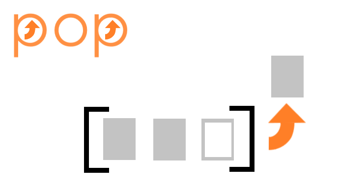
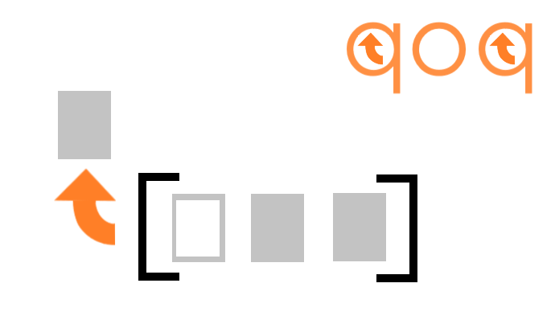
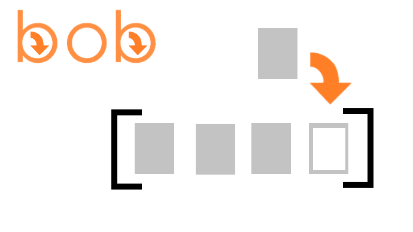

# pqbd

Can you never remember which is shift and which is unshift? Are you a competitive array manipulation speedrunner looking to shave 1-4 characters off of each of your method calls?

Then pqbd is for you!

pqbd stands for 'pop', 'qoq', 'bob', and 'dod'. What are those, you ask?

## pop()

array.pop() is still good old array.pop()

It pops an element off the end of an array and returns that element. 

So then when you mirror pop vertically you get...

## qoq()

array.qoq() is array.shift()

It qoqs an element off the start of the array and returns that element. 

So that was a vertical mirror, but what if we mirror pop horizontally?

## bob()

array.bob() is array.push()

It bobs an element onto the end of an array and returns the new length of the array.

One more, how about if we mirror pop vertically and horizontally?

## dod()

array.dod is array.unshift()

It dods an element on to the beginning of an array and returns the new length of the array.

## FAQ

### Should I use pqbd?

Probably not. It modifies the array prototype and may interfere with other packages. It may be used for recreational qoqqing and bobbing though.

### Can I use pqbd with TypeScript?

Yes you can! It was written in TS but again, don't actually use it. 

## Coming soon

* dop
* qob
* qop
* dob